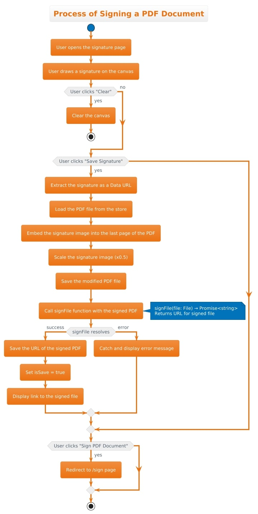
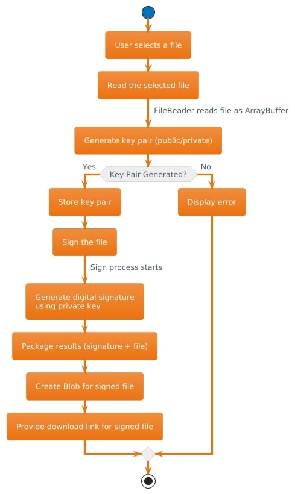
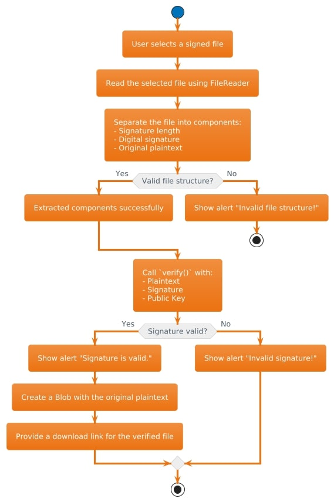

# EDS (Electronic Digital Signature)

EDS (Electronic Digital Signature) is a web-based application designed for signing and verifying documents digitally. It ensures secure, efficient, and legally compliant electronic document management.

## Features

- **Sign Documents:** Add a digital signature to PDF documents while generating a new signed version.
- **Verify Documents:** Verify the authenticity and integrity of previously signed documents.

## Demo

Explore the application live at:  
[EDS Application](https://bondarcuk-eds-app.netlify.app)

## How It Works

1. Upload a document you want to sign or verify.
2. Follow the guided steps to sign the document or check its signature's validity.
3. Download the signed or verified document.

## Block Diagram

### Document Signing Process

### Signing Algorithm

### Verification Algorithm

